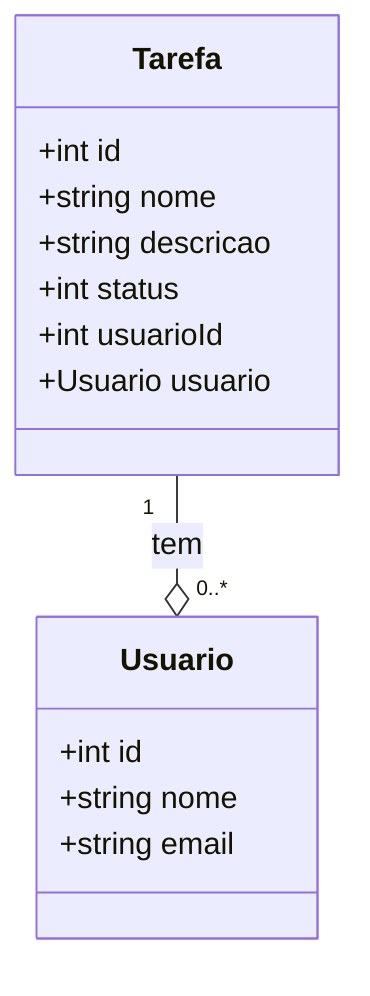
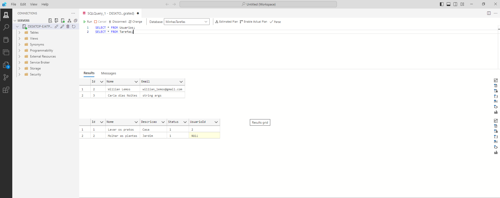
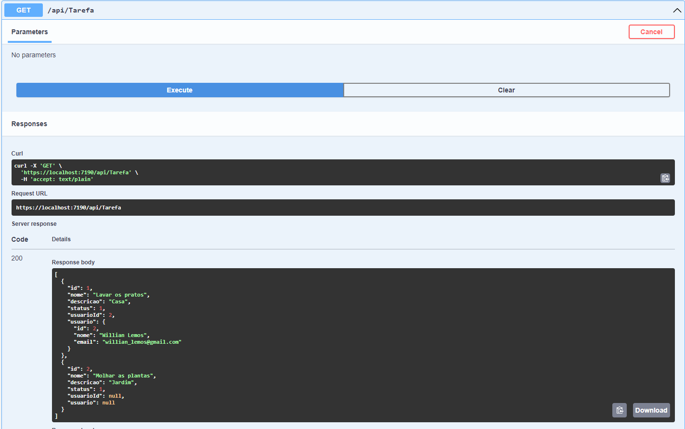
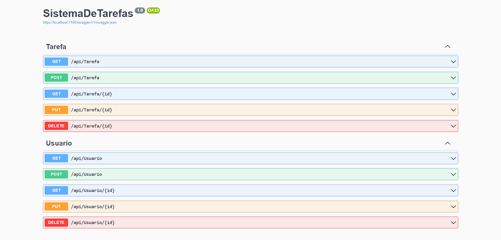

# Projeto Sistema de Tarefas

## Diagrama de Classes



### Criando o projeto
```bash
dotnet new webapi -n SistemaDeTarefas -f net6.0
```

### Instalando o EntityFramework
```bash
dotnet add package Microsoft.EntityFrameworkCore --version 6.0.1
```

```bash
dotnet add package Microsoft.EntityFrameworkCore.SqlServer
```

```bash
dotnet add package Microsoft.EntityFrameworkCore.Design --version 6.0.0

```

```bash
dotnet add package Microsoft.EntityFrameworkCore.Tools
```

### Gerando a primeira migration `Usuários`
```bash
dotnet ef migrations add InitialCreate
```

### Executando migrations pendentes
```bash
dotnet ef database update
```

### Gerando a segunda migration `Tarefas`
```bash
dotnet ef migrations add usuario-tarefa
```

### Executando migration pendentes
```bash
dotnet ef database update
```

### Exemplo do banco de dados local


### `GET` api/Tarefa


## Como usar o projeto?

### Instale as dependências
```bash
dotnet restore
```
### Coloque o servidor no ar `localmente`
```bash
dotnet run
```

### Utilize as rotas pelo `Swagger`

[Swagger](https://localhost:7190/swagger/index.html)



