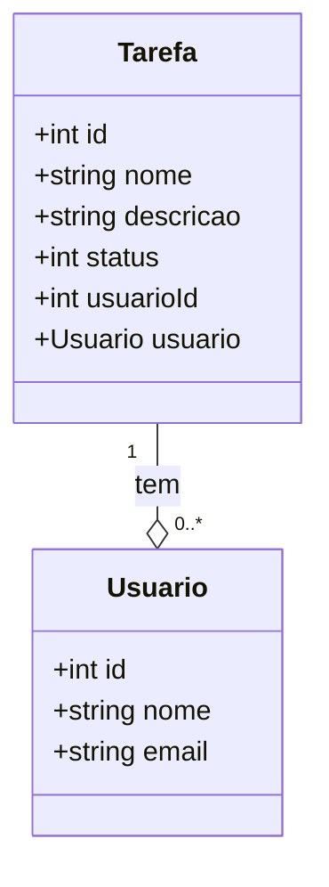

# Projeto Sistema de Tarefas

## Diagrama de Classes



### Criando um projeto
```bash
dotnet new webapi -n SistemaDeTarefas -f net6.0
```

### Instalando o EntityFramework
```bash
dotnet add package Microsoft.EntityFrameworkCore --version 6.0.1
```

```bash
dotnet add package Microsoft.EntityFrameworkCore.SqlServer
```

```bash
dotnet add package Microsoft.EntityFrameworkCore.Design --version 6.0.0

```

```bash
dotnet add package Microsoft.EntityFrameworkCore.Tools
```

### Gerando inicial migration
```bash
dotnet ef migrations add InitialCreate
```

### Executando as migrations
```bash
dotnet ef database update
```

### Executando servidor
```bash
dotnet run
```

[Swagger](https://localhost:7190/swagger/index.html)

### Gerando a migration da relação Usuário e tarefa
```bash
dotnet ef migrations add usuario-tarefa
```

### Executando as novas migrations
```bash
dotnet ef database update
```